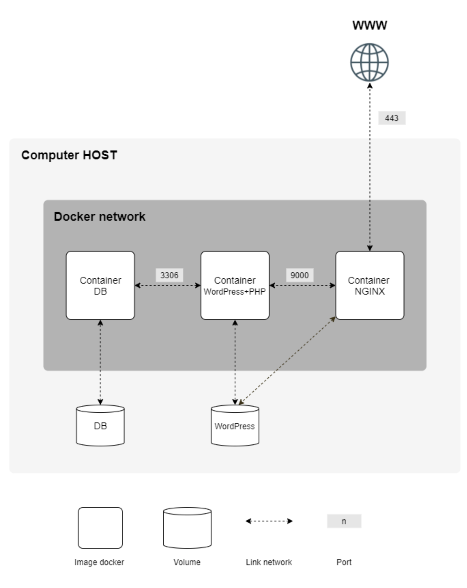

# INCEPTION

## The purpose of the project?

This project is an introduction to docker and the concept of containerization, the project job is the set up three containers, one for the Databases containing the MariaDB database that is linked with docker volume, and another container that contains WordPress installed and linked with another volume, those two previous containers are connected via port 3306, and the wordpress container connected to nginx web server that is connected via port 9000 using SSL certificates (TLS v1.2), the nginx container point in the same volume as the one of wordpress.

## How you can run the project?

Run the following command to clone the project in your local machine:
   
`git clone https://github.com/Mohamed-Moumni/INCEPTION.git`
   
Firstly You should install docker and docker-compose and make in your OS, then go the terminal and type
   
`make run`
  

## Server structure for mandatory?

Discribed below :

## What is new in the bonus?

In bonus part, I configured five services, described below:

* Setup Redis:
    Set up Redis cache for  my WordPress website in order to properly manage the Cache.
* Setup FTP:
    Set up an FTP server container pointing to the volume of my WordPress website.
* Setup static website:
    I created a simple static website using (HTML/CSS javascript) and I use the Apache web server.
* Setup Adminer:
    Adminer is a tool for managing databases. It is similar to other popular database management tools like phpMyAdmin and SQL Management Studio, but it is designed to be lightweight and easy to use
* Setup Cadvisor:
    CAdvisor (short for "container Advisor") is an open-source tool developed by Google for monitoring resource usage and performance of containerized applications.

For more infos check the subject of the project in the subject folder.

## Resources and tutorial

* <a href="https://mmoumni.notion.site/INCEPTION-dd43a99ce2af40348014ee72912f3f90"> Notion </a>

* https://medium.com/dev-sec-ops/docker-101-volume-bind-mounting-8f200c14ca0
* https://leandronsp.com/mastering-docker-volumes
* https://leandronsp.com/mastering-the-docker-networking
* https://blog.bitsrc.io/best-practices-for-writing-a-dockerfile-68893706c3
* https://medium.com/@BeNitinAgarwal/best-practices-for-working-with-dockerfiles-fb2d22b78186
* https://www.linode.com/docs/guides/getting-started-with-nginx-part-3-enable-tls-for-* https/
* https://www.digitalocean.com/community/tutorials/how-to-create-a-self-signed-ssl-certificate-for-nginx-on-centos-7
* https://codingwithmanny.medium.com/custom-wordpress-docker-setup-8851e98e6b8
* https://medium.com/swlh/wordpress-deployment-with-nginx-php-fpm-and-mariadb-using-docker-compose-55f59e5c1a
* https://stackoverflow.com/questions/21553353/what-is-the-difference-between-cmd-and-entrypoint-in-a-dockerfile
* https://www.nginx.com/blog/automating-installation-wordpress-with-nginx-unit-on-ubuntu/
* https://kinsta.com/blog/wp-config-php/
* https://www.digitalocean.com/community/tutorials/how-to-set-up-vsftpd-for-a-user-s-directory-on-debian-10
* https://www.jscape.com/blog/active-v-s-passive-ftp-simplified
* https://www.experts-exchange.com/articles/22179/Network-Ports-what-they-are-and-they-work.html
* https://www.digitalocean.com/community/tutorials/how-to-configure-nginx-as-a-reverse-proxy-on-ubuntu-22-04
* https://dev.to/moyarich/how-to-find-the-storage-location-of-docker-images-and-containers-on-a-mac-369i
* https://gist.github.com/onlyphantom/0bffc5dcc25a756e247cb526c01072c0
* https://medium.com/dev-sec-ops/docker-101-layered-architecture-networking-ce07f334474d
* https://levelup.gitconnected.com/write-go-like-a-senior-engineer-eee7f03a1883
* https://medium.com/trainingpeaks-product-development/understanding-docker-and-docker-compose-5f1b63d6ec0a
* https://stackoverflow.com/questions/28608015/continuous-integration-vs-continuous-delivery-vs-continuous-deployment
* https://medium.com/jaanvi/basics-of-ci-cd-pipeline-5762e0eca44e
* https://stackoverflow.com/questions/29480099/whats-the-difference-between-docker-compose-vs-dockerfile
* https://github.com/docker-library/redis/issues/301
* https://dev.to/techworld_with_nana/what-problems-does-docker-really-solve-496a
* https://stackoverflow.com/questions/32255814/what-purpose-does-using-exec-in-docker-entrypoint-scripts-serve/32261019#32261019
* https://codewithyury.com/docker-run-vs-cmd-vs-entrypoint/
* https://servebolt.com/help/article/configuring-wordpress-with-redis-from-the-command-line/
* https://medium.com/swlh/what-exactly-is-docker-1dd62e1fde38