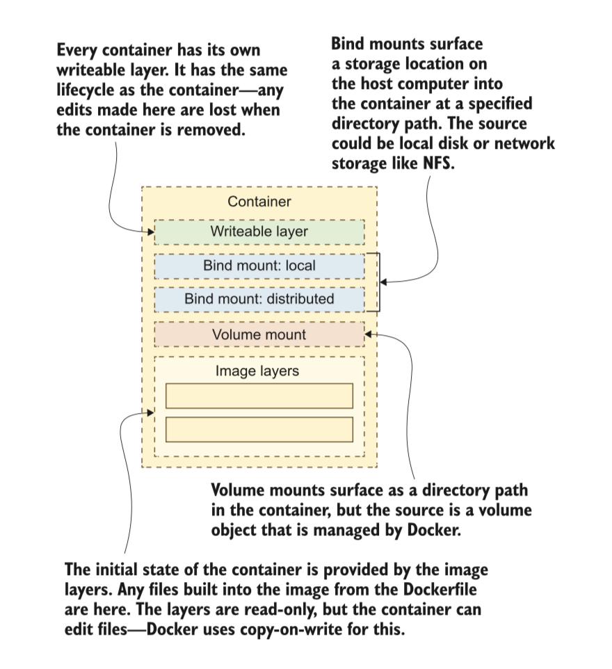

# INCEPTION
This project is an introduction to docker and the concept of containerization, the project job is the set up three containers, one for the database that linked the one of WordPress, and linked with the one of nginx, The structure of the project like the illustration below.


<br></br>

## What problems Docker solve ?

Most of the modern applications have similar setups. They all use a combination of different technologies to
assemble a complete application functionality. An example would be an app that uses combination of following
services:

* Node.js for Webserver
* ReactJs for frontend
* MongoDb as a database
* Messaging system - Redis
* Orchestration tool - Ansible

These technologies each have a version the application depends on, also the application isn't an isolated thing
that just floats around. It needs to run in an environment, since the environment can differ in OS, version, hardware etc, it's obvious that the application and its technologies with their respective versions should work the same on different environments.
Without docker, this means that each environment that the application runs on (local dev environment, a test or production server) needs to be configured with the correct versions of these services so that application can run properly.

**So the following problems arise**

* Compatibility of each service with the underlying OS
* Compatibility of each service with the libraries and dependencies of OS (One service requires versionX of OS library. Another service - versionY of same library)
* Every time version of any service updates, you might need to recheck compatibilities with underlying OS infrastructure
* For a new developer to setup the environment with right OS and Service versions

**Docker Solution**

* Each service has and can manage its required OS dependencies for itself, bundled and isolated in its own container
* Change the components without affecting the other services
* Change underlying OS without affecting any of the services

As a result, docker should avoid the typical "works on my machine" cases. In the development process, for example, developers and testers will have the identical environment where the application runs, since this environment is packaged in docker containers, which just like a file, can be transferred around as an artifact.

## What is Docker?

Docker is an open source project for building, shipping, and running programs. It is a command- line program, a background process, and a set of remote services that take a logistical approach to solving common software problems and simplifying your experience installing, running, publishing, and removing software. It accomplishes this by using an operating system technology called containers

## What is Container?

When we run applications on our computer, this could be the web browser or VScode that you are using to read this post. That application is running as a process or what is known as a process. On our laptops or systems, we tend to run multiple applications or as we said processes. When we open a new application or click on the application icon this is an application we would like to run, sometimes this application might be a service that we just want to run in the background, our operating system is full of services that are running in the background providing you with the user experience you get with your system.

That application icon represents a link to an executable somewhere on your file system, the operating system then loads that executable into memory. Interestingly, that executable is sometimes referred to as an image when we're talking about a process.

Containers are processes, A container is a standard unit of software that packages up code and all its dependencies so the application runs quickly and reliably from one computing environment to another.

Containerised software will always run the same, regardless of the infrastructure. Containers isolate software from its environment and ensure that it works uniformly despite differences for instance between development and staging.

I mentioned images in the last section when it comes to how and why containers and images combined made containers popular in our ecosystem.


## What is an Image?

A container image is a lightweight, standalone, executable package of software that includes everything needed to run an application: code, runtime, system tools, system libraries and settings. Container images become containers at runtime

### The anatomy of a Docker image

A Docker image is a read-only template that contains a set of instructions for creating a container that can run on the Docker platform. It provides a convenient way to package up applications and preconfigured server environments, which you can use for your private use or share publicly with other Docker users. Docker images are also the starting point for anyone using Docker for the first time.

To create an image you should write your instructions for the image in a dockerfile. so What is a dockerfile ?

### What is a Dockerfile ?

A dockerfile is a text file that contains commands you would normally execute manually to build a docker image. Docker can build images automatically by reading the instructions we have in our dockerfile.

Each of the files that make up a docker image is known as a layer. these layers form a series of images, built on top of each other in stages. Each layer is dependent on the layer immediately below it. The order of your layers is key to the efficiency of the lifecycle management of your docker images


### How to create a Docker image ?

You can create a Docker image by creating a dockerfile for the needed image and add the commands you need to assemble The image.
The following commands are the most used for creating dockerfile:

 ---------------------------------
| Command         | Purpose     |
|-----------------|-------------|
| FROM            | To specify the base image.|
| WORKDIR         | To set the working directory for any commands that follow in the Dockerfile.|
| RUN             | To install any applications and packages required for your container.|
| COPY            | To copy over files or directories from a specific location.|
| ADD             | As COPY, but also able to handle remote URLs and unpack compressed files.|
| ENTRYPOINT      | Command that will always be executed when the container starts. If not specified, the default is /bin/sh -c.|
| CMD             | Arguments passed to the entrypoint. If ENTRYPOINT is not set (defaults to /bin/sh -c), the CMD will be the commands the container executes.|
|EXPOSE           | To define which port through which to access your container application.|
|LABEL            | To add metadata to the image.|
 --------------------------------------------------
<br></br>
For example in This project the Dockerfile of NGINX image look like:
<br></br>
``` Dockerfile
FROM    debian:buster

RUN     apt update && apt -y install nginx && apt install -y openssl && openssl req -x509 -nodes -days 365 -newkey rsa:2048 -keyout /etc/ssl/private/nginx-selfsigned.key -out /etc/ssl/certs/nginx-selfsigned.crt -subj="/CN=mmoumni/O=moumni.1337.ma/C=MA/L=KHOURIBGA"

COPY    ./conf/default /etc/nginx/sites-enabled/default

CMD     ["nginx", "-g", "daemon off;"]
```

## Docker Compose

The ability to run one container could be great if you have a self-contained image that has everything you need for your single use case, where things get interesting is when you are looking to build multiple applications between different container images. For example, if I had a website front end but required a backend database I could put everything in one container but better and more efficient would be to have its container for the database

This where Docker compose comes in which is a tool that allows you to run more complex apps over multiple containers. 
Good example is the given in the project we have 3 services each one inside a container.

### Docker-Compose.yml (YAML)

The next thing to talk about is the docker-compose.yml which you can find in the container folder of the repository. But more importantly, we need to discuss YAML, in general, a little.
YAML could almost have its session as you are going to find it in so many different places. But for the most part
"YAML is a human-friendly data serialization language for all programming languages."

This is a configuration file of what we want to do when it comes to multiple containers being deployed on our single system

You can See the Docker-compose.yml that I used in the project:
``` Docker-compose.yml
version: '3.5'

services:
    mariadb:
        build: ./requirements/mariadb
        container_name: mariadb
        image: mariadb
        env_file:
            - .env
        restart: always
        volumes:
            - data_db:/var/lib/mysql/
        networks:
            - nat
    nginx:
        build: ./requirements/nginx
        container_name: nginx
        image: nginx
        env_file:
            - .env
        ports:
            - 443:443
        restart: on-failure
        depends_on:
            - wordpress
        volumes:
            - data:/var/www/html/
        networks:
            - nat
    wordpress:
        build: ./requirements/wordpress
        container_name: wordpress
        image: wordpress
        env_file:
            - .env
        restart: always
        depends_on:
            - mariadb
        volumes:
            - data:/var/www/html/
        networks:
            - nat
volumes:
    data:
        driver: local
        driver_opts:
            device : /Users/mmoumni/Desktop/INCEPTION/srcs/data
            type : none
            o: bind
    data_db:
        driver: local
        driver_opts:
            device: /Users/mmoumni/Desktop/INCEPTION/srcs/data_db
            type: none
            o: bind
networks:
    nat:
        driver: bridge
```

## What is Volumes?

A Docker volume is a unit of storage—you can think of it as a USB stick for containers. Volumes exist independently of containers and have their own life cycles, but they can be attached to containers. Volumes are how you manage storage for stateful applica- tions when the data needs to be persistent. You create a volume and attach it to your application container; it appears as a directory in the container’s filesystem. The con- tainer writes data to the directory, which is actually stored in the volume. When you update your app with a new version, you attach the same volume to the new container, and all the original data is available.
There are two ways to use volumes with containers: you can manually create vol- umes and attach them to a container, or you can use a VOLUME instruction in the Dockerfile. That builds an image that will create a volume when you start a container



- Writeable layer : Perfect for short-term storage, like caching data to disk to save on network calls or computations. These are unique to  each container but are gone forever when the container is removed.
- Local bind mounts : Used to share data between the host and the container. Developers can use bind mounts to load the source code on their computer into the container, so when they make local edits to HTML or JavaScript files, the changes are immediately in the container without having to build a new image.
- Distributed bind mounts : Used to share data between network storage and con- tainers. These are useful, but you need to be aware that network storage will not have the same performance as local disk and may not offer full filesystem fea- tures. They can be used as read-only sources for configuration data or a shared cache, or as read-write to store data that can be used by any container on any machine on the same network.
- Volume mounts : Used to share data between the container and a storage object that is managed by Docker. These are useful for persistent storage, where the application writes data to the volume. When you upgrade your app with a new container, it will retain the data written to the volume by the previous version.
- Image layers : These present the initial filesystem for the container. Layers are stacked, with the latest layer overriding earlier layers, so a file written in a layer at the beginning of the Dockerfile can be overridden by a subsequent layer that writes to the same path. Layers are read-only, and they can be shared between containers.


## How docker Network works?

## What is DockerHub?

## BONUS PART

### Redis CACHING

